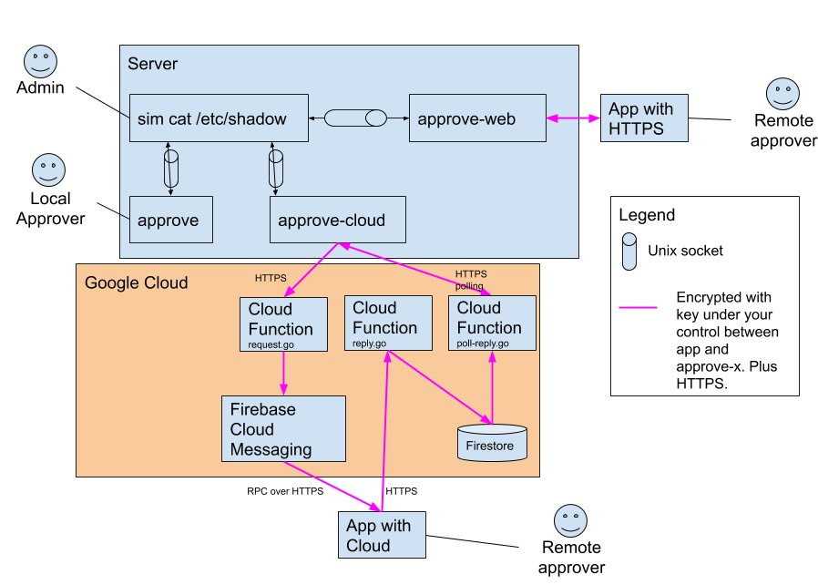

# Sim over cloud messaging

The neatest way to send a request to a phone or other device for approval is to
use cloud messaging. Used to be called Google Cloud Messaging, now Firebase
Cloud Messaging (FCM).

## Setup

1. Install [the app][app] on your phone
1. In the app, open settings
1. Enable cloud, disable websockets
1. Enter a long and secure PIN.
1. Back on the start page of the app, click the tripple dot menu and choose
   "Copy device token". This is used to direct messages to your phone.
1. Paste that token ID in an email to yourself or something. You'll need it in a
   few steps.
1. Build `approve-web`: `go build ./cmd/approve-web`
1. Set the same PIN as `SIM_PIN`:  `export SIM_PIN="same password here"`
1. Start `approve-web`: `./approve-web -device="that-long-device-id"`
1. Done. `sim` commands should now be forwarded to your phone for approval.

## Security of the PIN

This is used as encryption&authentication key as the request and approval goes
through Google's cloud. All communication also goes through standard HTTPS with
encryption.

You should treat the PIN as "offline-crackable", so ideally use a password
generator, like [opwgen][opwgen], that uses 128 bits of entropy so that even
a supercomputer can't crack it.

Someone who has your PIN *and* knows the ID of a request is able to approve the
command. The ID should not be seen as secret, since it's the same as the
filename of the unix socket.

In [the future][bug-id] the reply channel ID will generated from scratch, but
currently it's the HMAC of the ID with the PIN, but it should not be seen as
secret from the Cloud provider.

## Architecture

This section describes how data flows, and is not necessary to know in order to
use this system.

It's easy to receive messages on the phone using FCM, but sending them is
harder. Sending in either direction for our purposes is a bit tricky.

The "server" here is the machine where 'sim' is run. The "phone" is where the
app runs.

Note that while the request and response goes via Google servers, TODO: before
this is in production the request and response must be encrypted and signed
between the server and the phone. Not implemented yet, but not hard to do since
we already have the concept of shared secret.

That will prevent even Google from seeing or approving anything of yours. But of
course if Google breaks or blocks FCM, then your `sim` commands will not be able
to be approved by the app. The local `approve` command will be unaffected, since
it only uses a unix socket.

### From server to phone

In order to send FCM messages you need GCP credentials. You're not allowed to
ship those credentials in the source code, and if you generate your own they'll
only have access to *your* project, and therefore you need to create the rest of
the FCM project settings.

So Sim opted to instead rely on a Cloud Function. This means that the server
only needs to send an HTTPS request, and a Cloud Function will take care of
turning that into a FCM message.

The source code to this Cloud Function is `cloud-functions/request.go`

### From phone to server

While the phone could send a FCM message for the server to pick up, that would
again mean that the server would need GCP credentials. This is not a dependency
we want.

So instead the phone replies by HTTPS request to a Cloud Function. It stores the
response in a FireStore database.

The server polls via Cloud Functions for when an approval is accepted or
rejected.

Requests time out in 10 minutes.

### Communication diagram

[app]: https://play.google.com/store/apps/details?id=com.thomashabets.simapprover
[opwgen]: https://github.com/ThomasHabets/opwgen
[bug-id]: https://github.com/ThomasHabets/sim/issues/8

